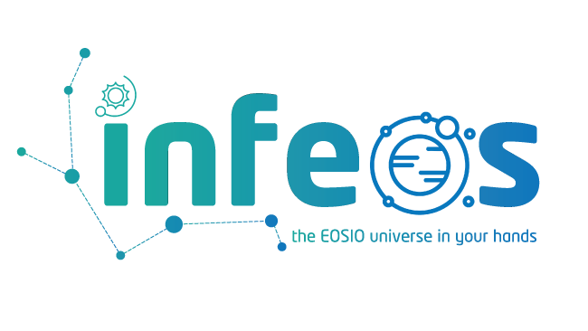

<p align="center"><a href="https://t.me/infeos"></a></p>

# infeos: The EOSIO universe in your hands
infeos is an EOSIO development, building, testing, and deployment framework based and using javascript, npm, eosjs and the EOSIO protocol.

**infeos** is the easiest, fastest and the most straightforward way to develop EOSIO based dApps. Some of it's key features are:

1. Set up your development environment in less than 5 minutes and in less than 1 minute for each new project after the first one.
   
2. Starting a full local node in a matter of seconds with only one command and choosing your preferred network: EOS, Telos or Worbli.
   
3. Unit tests your EOSIO smart contracts using **javascript**. 
   
4. Full control over your environment configurations and deployment setup
   
5. Optimized dApp project structure - with infeos we're introducing a new EOSIO dApp projects structure where you have one master smart contract that rule them all
   
6. With infeos, you don't need to be an EOSIO developer, neither blockchain developer to work with smart contracts. All back-ends and front-ends developers now have the power to work with you dApp on blockchain level in just learning a few commands

Find us on: [**Telegram**](https://t.me/infeos) | [**Twitter**](https://twitter.com/infeos_io)

### The universe message dashborard
---
- Full Documentation - **In Progress** (Check out the example template for details)
---

# Pre-instalation
*If you already have these programs on your computer please continue with the actual installation*

### Mac OS
- Download and install [Docker Desktop for Mac](https://docs.docker.com/docker-for-mac/install/)
- Install **Kitematic** for Mac OS - the best GUI to work with your containers
- Install [node.js](https://nodejs.org/en/)

### Windows
- Download and install [Docker Desktop for Windows](https://docs.docker.com/docker-for-windows/install/)
- Download and install [Cygwin64](https://cygwin.com/install.html)
- Download and install git bash (if missing)

After each installation setup your programs for use. That includes but not limited to accounts, login, configurations.

# Installation

To install infeos run the following command:

```
npm install infeos -g
```

# Initialize

To initialize a new EOSIO project run the command below. It will automatically create a new project including example smart contracts, tests, configurations.

```
infeos init
```

# Start local EOSIO node

If you're running the command for the first time it will take some time before the Docker image is downloaded (it's downloaded globally and only for this project). Once the image is available the node starts in a matter of seconds. 

```
infeos run-node
```

If you re-run the command a new fresh and clean node will be create replacing the old one.


# Compile 

To compile your smart contract and to generate WASM & ABI files the following command:

```
infeos compile [abi]
```


# Deploy

When you the command below you'll be able to deploy your smart contract to the blockchain. You can find more details about the deployment script **deploy.js** inside the deployment folder. Once the process is complete an instance of the contract is returned in the code. You can use it for further development and testing.

```
infeos deploy
```

# Test

Running the test command will execute all test located in the **test*** folder. You have the option to pass a specific test file to be executed

```
infeos test [path]
```
